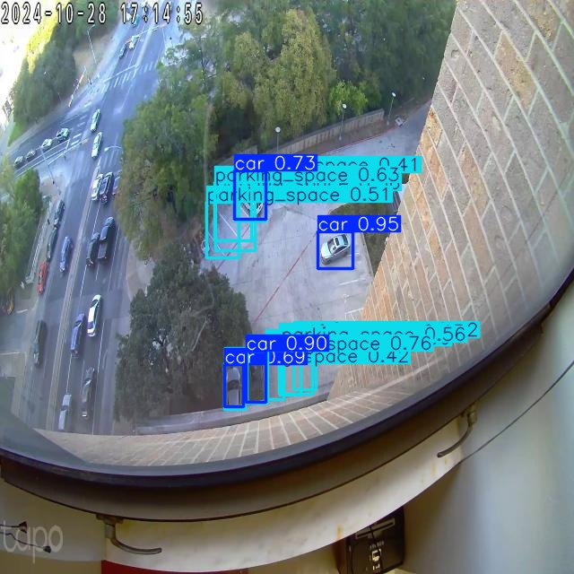
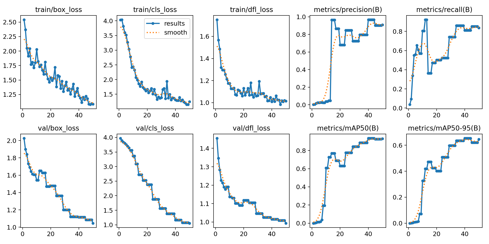

# AI-Based Parking Lot Monitoring

A computer vision pipeline to detect vehicles and parking spaces from surveillance camera footage, classify each space as occupied or vacant, and generate automated occupancy reports — built as part of research at the **Inspire Lab, University of Texas at Austin**.

---

## Overview

This project processes top-down aerial footage from real parking lot surveillance cameras. A YOLOv8 model was trained to detect two classes — cars and parking spaces — and an IoU-based occupancy logic layer determines which spaces are taken. Results are visualized with color-coded bounding boxes and exported as a CSV summary report.


### Detection Output



### Occupancy Classification


---

## What This Does

1. Takes frames captured from real parking lot camera footage
2. Runs a trained YOLOv8n model to detect cars and parking spaces
3. Uses IoU overlap to classify each space as **occupied** (red) or **vacant** (green)
4. Saves annotated output images and a CSV occupancy summary across all frames

---

## Pipeline


Surveillance Camera Footage
        │
        ▼
  Frame Extraction
        │
        ▼
 YOLOv8n Inference
  (car + parking_space)
        │
        ▼
  IoU Occupancy Logic
  (space vs. car overlap)
        │
        ▼
  Annotated Output Images
  + occupancy_summary.csv


---

## Tech Stack

| Component | Tool |
|---|---|
| Detection model | YOLOv8n (Ultralytics 8.3) |
| Vision pipeline | Python, OpenCV |
| Deep learning | PyTorch 2.6, CUDA |
| Dataset labeling | Roboflow (polygon → bbox conversion) |
| Visualization | Matplotlib |
| Reporting | Pandas (CSV export) |
| Environment | Google Colab |

---

## Dataset

- **Source:** Top-down parking lot images captured from real surveillance cameras
- **Annotation:** Exported from Roboflow as YOLOv11-style polygon segmentation labels
- **Classes:** `car` (class 0), `parking_space` (class 1)
- **Preprocessing:** Polygon masks converted to YOLOv8 bounding box format via min-max coordinate bounds
- **Splits:** `/train`, `/valid`, `/test`
- **Scale:** Small dataset (~10 training images); model trained with data augmentation (blur, grayscale, mosaic) via Albumentations

> Note: The dataset is small and results are best treated as a proof-of-concept pipeline. Performance would improve with more labeled frames.

---

## Model Training

Multiple YOLO versions were tested across experiments to compare detection performance on the parking dataset:

| Model | Params | Notes |
|---|---|---|
| YOLOv8n | 3.01M | Lightweight baseline, fast inference |
| YOLOv8s | 11.1M | Better accuracy, slower on CPU |
| YOLOv11n | ~2.6M | Newer architecture, tested for comparison |

YOLOv8n was used for the final pipeline given its speed-accuracy tradeoff on a small dataset and CPU-constrained Colab environment.

```python
from ultralytics import YOLO

model = YOLO("yolov8n.pt")  # also tested yolov8s.pt, yolo11n.pt
model.train(
    data="aiparking_detection/data.yaml",
    epochs=50,
    imgsz=640,
    batch=8
)
```

**Config (`data.yaml`):**
```yaml
path: /content/aiparking_detection
train: train/images
val: train/images

names:
  0: car
  1: parking_space
```

**Optimizer:** AdamW (lr=0.001667, momentum=0.9), auto-selected by Ultralytics  
**Model:** 129 layers, 3.01M parameters, 8.2 GFLOPs  
**Augmentations:** Blur, MedianBlur, ToGray (via Albumentations)


### Training Curves

---

## Occupancy Logic

After inference, each detected parking space is compared against all detected cars using **Intersection over Union (IoU)**. A space is marked occupied if IoU with any car exceeds 0.3.

```python
def compute_iou(boxA, boxB):
    xA = max(boxA[0], boxB[0])
    yA = max(boxA[1], boxB[1])
    xB = min(boxA[2], boxB[2])
    yB = min(boxA[3], boxB[3])
    inter = max(0, xB - xA) * max(0, yB - yA)
    areaA = (boxA[2] - boxA[0]) * (boxA[3] - boxA[1])
    areaB = (boxB[2] - boxB[0]) * (boxB[3] - boxB[1])
    return inter / (areaA + areaB - inter + 1e-6)
```

- **Red box** = Occupied space
- **Green box** = Vacant space

---

## Output

**Per image:** Annotated PNG with color-coded bounding boxes  
**Batch report:** `occupancy_summary.csv`

| image | total_spaces | occupied | vacant |
|---|---|---|---|
| frame_0.jpg | 13 | 5 | 8 |
| frame_5.jpg | 13 | 3 | 10 |

---

## Running the Pipeline

### 1. Install dependencies
```bash
pip install ultralytics opencv-python pandas matplotlib
```

### 2. Prepare your dataset
Convert any Roboflow polygon exports to bbox format using the included `convert_polygon_to_bbox_line()` utility, then structure into:
```
aiparking_detection/
├── train/images/
├── train/labels/
├── test/images/
├── test/labels/
└── data.yaml
```

### 3. Train
```python
model = YOLO("yolov8n.pt")
model.train(data="aiparking_detection/data.yaml", epochs=50, imgsz=640, batch=8)
```

### 4. Run batch occupancy detection
```python
model = YOLO("runs/detect/train/weights/best.pt")
# See occupancy_pipeline.py for full batch processing + CSV export
```

---

## Limitations & Next Steps

- [ ] Expand training dataset — more frames, more varied lighting and angles
- [ ] Adapt pipeline to process video directly (frame-by-frame loop)
- [ ] Tune IoU threshold per camera angle/space size
- [ ] Explore YOLOv8s or YOLOv8m for better accuracy with more data
- [ ] Add real-time dashboard output

---

## Project Context

Developed as part of AI research at the **Inspire Lab, University of Texas at Austin**, focused on scalable computer vision for smart campus infrastructure. Involved setting up cameras, capturing footage, labeling data, training the model, and building the end-to-end occupancy pipeline from scratch.

**Duration:** September 2024 – July 2025  
**Role:** AI Research Assistant

---

## Author

**Angela Chen**  
[LinkedIn](https://linkedin.com/in/tzu-yuchen) · [GitHub](https://github.com/angela-tyc)
